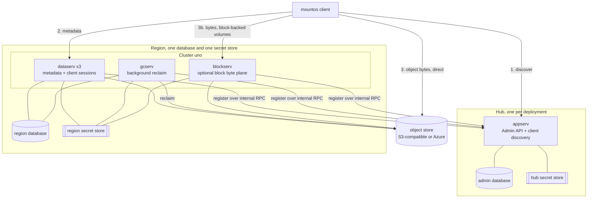
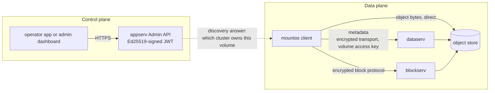
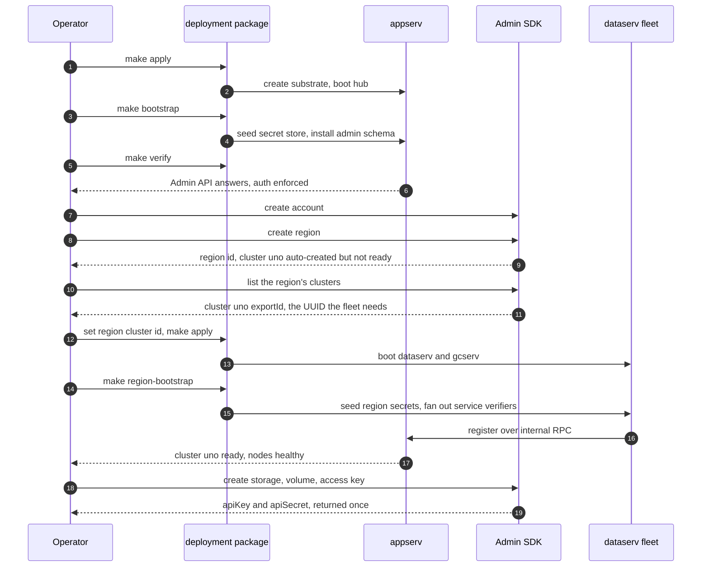
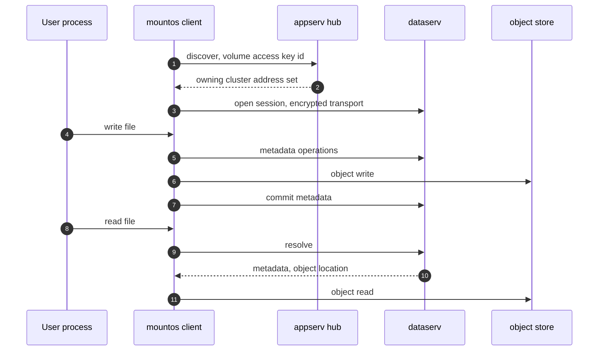
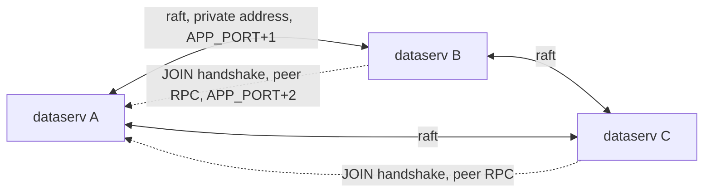
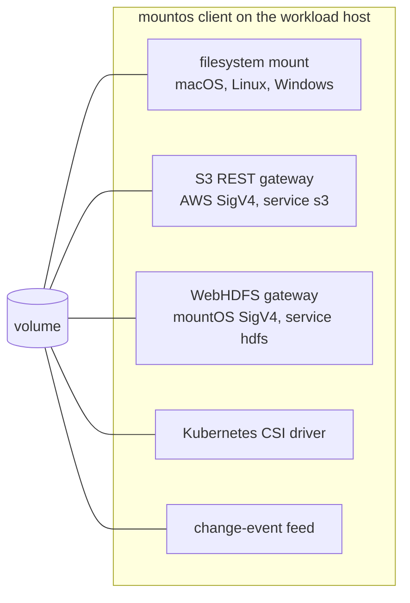
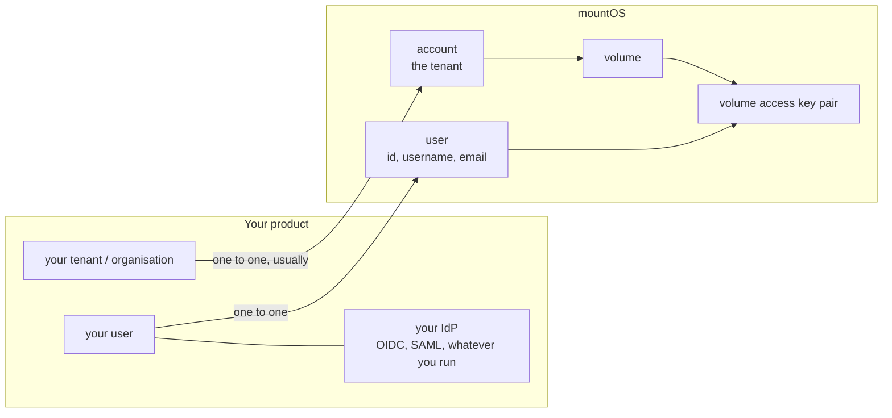
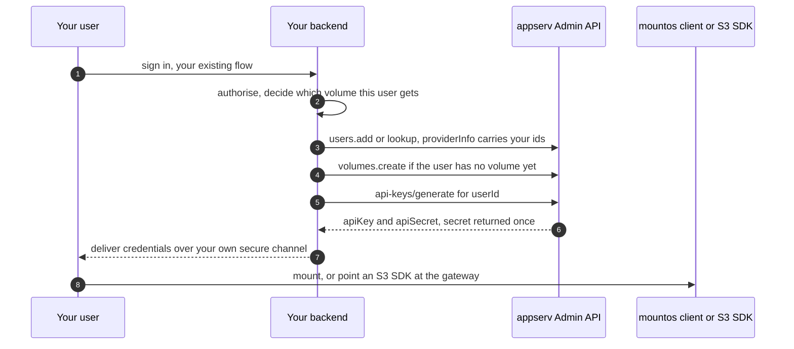
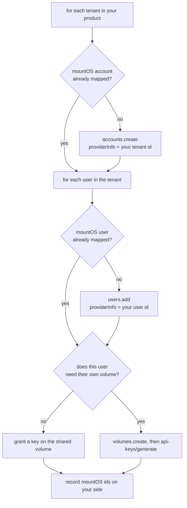

# mountOS deploy skill (single-file bundle, version 1.0.0)

This file is the entire skill in one document: the entry point followed by every
reference it links to. It exists for agents that cannot follow relative links or read
a directory. The links below point at sections in this same file.

Source and updates: https://github.com/mountos-io/skills

---


# mountOS

mountOS is self-hosted, POSIX-compatible distributed storage. It gives native filesystem
mounts on macOS, Linux, and Windows over the same data, plus S3 and WebHDFS gateways, with
forks, time travel, and one-minute versioning. The operator runs it on infrastructure they
control.

This skill is the deployment and operations entry point. It carries what a real bring-up
teaches you and what the reference documentation cannot: the order of operations, the
assertions that prove each stage, and the failure modes that look like success.

## Step 0: load the live context first

**Always do this before you plan or run anything.** This repository is deliberately thin.
The authoritative documentation is generated from the current mountOS source and is
published on the web, so it is correct for the version the operator is about to install.
Where this repository and the live documentation disagree, the live documentation wins.

Fetch in this order:

| Order | URL | What it gives you |
| --- | --- | --- |
| 1 | https://mountos.io/skill.md | Entry-point skill: the mental model and the task-to-skill routing table |
| 2 | https://mountos.io/llms.txt | Topic index: one line per topic, with its URL |
| 3 | https://mountos.io/skills/deploy.md | Cloud substrate and hub bring-up |
| 4 | https://mountos.io/skills/provision.md | Account, region, cluster, region services |
| 5 | https://mountos.io/skills/volumes.md | Storages, volumes, access keys, mounting |

Fetch other task skills (`operate.md`, `integrate.md`, `s3.md`, `iceberg.md`, `env.md`) and
topic pages (`https://mountos.io/ai/topics/<slug>.md`) as the task needs them. The full
corpus is at https://mountos.io/ai/llms-full.txt, which is large; prefer the index and the
single topic you need.

If you have no network access, say so plainly before you continue. You can still work from
the references in this repository, but tell the operator that you are working from a cached
summary and that version-specific details are unverified.

## Keep this skill current

This skill is version `1.0.0`. Two different things go stale, and they are refreshed
differently.

- **mountOS facts** (flags, variable names, endpoints, defaults) refresh on every use,
  through step 0. Nothing to upgrade.
- **This guidance** (the runbook, the pitfalls, the diagrams) ships in the repository and
  only changes when the repository is updated.

Check for a newer skill release when a deployment task starts, or when guidance here does
not match what the operator sees:

```bash
curl -fsSL https://raw.githubusercontent.com/mountos-io/skills/main/deploy/VERSION
```

If that value is higher than `1.0.0`, tell the operator, point them at
https://github.com/mountos-io/skills/blob/main/deploy/CHANGELOG.md, and offer the upgrade:

```bash
git -C ~/.mountos-skills pull --ff-only
```

Adjust the path if the clone lives somewhere else. Do not silently continue on a
known-stale version when the changed guidance is relevant to the task in hand.

## Mental model

Enough to route correctly. The live documentation is authoritative for the detail.

- The **hub** is `appserv`. There is exactly one per deployment and it is multi-tenant. It
  owns the admin database and the hub secret store, serves the Admin API at
  `<hub>/api/v1/*`, and answers client discovery. Its domain is the discovery URL every
  client is given.
- An **account** is the tenant. It owns its regions, users, and storages.
- A **region** belongs to one account and owns one database and one secret store. It holds
  storages, each pointing at an S3-compatible or Azure object store.
- A **region cluster** partitions volume load inside a region. It shares the region's
  database and secret store. `dataserv`, `gcserv`, `blockserv`, and the gateways are
  cluster-scoped. Creating a region auto-creates its default cluster, named `uno`.
- A **volume** lives in one region on exactly one storage. Its data does not cross a region
  boundary at serving time.
- The client binary is `mountos`. It discovers at the hub, then talks to the owning cluster
  directly.

## Route the task

| The operator wants to | Read |
| --- | --- |
| Understand the architecture, or draw it | [references/architecture.md](#reference-architecture), plus https://mountos.io/ai/topics/architecture.md |
| Add mountOS under an existing product and an existing user base | [references/integration.md](#reference-integration) |
| Create cloud infrastructure and bring up the hub | https://mountos.io/skills/deploy.md, then [references/runbook.md](#reference-runbook) |
| Create the tenant, region, and region services | https://mountos.io/skills/provision.md |
| Create storages, volumes, and access keys, and mount | https://mountos.io/skills/volumes.md |
| Mount in production, with fstab or a mount helper | https://mountos.io/skills/volumes.md, section on the mount helper |
| Inspect a running deployment or a live mount | https://mountos.io/skills/operate.md, plus the client's read-only MCP connector |
| Use S3, WebHDFS, Kubernetes CSI, or the change feed | https://mountos.io/skills/integrate.md |
| Understand what an environment variable does | https://mountos.io/skills/env.md |
| Work out why a healthy-looking deployment does not work | [references/pitfalls.md](#reference-pitfalls) |
| Deploy on GCP or Azure rather than AWS | [references/clouds.md](#reference-clouds) |
| Prove a stage actually completed | [references/verification.md](#reference-verification) |

## Deployment spine

The order is load-bearing. Each stage has an assertion that must pass before the next one
starts. Do not treat "the command exited 0" as the assertion.

1. **Substrate and hub.** Drive the `mountos-io/deployment` package. Do not hand-roll
   Terraform or systemd. Assertion: the hub answers the Admin API with auth enforced.
2. **Tenant.** Create the account, then the users. Assertion: the account reads back with
   its id.
3. **Region.** Create the region, which auto-creates cluster `uno`. Assertion: you can read
   back the region cluster id, a UUID. You need this value for the next stage.
4. **Region services.** Put the region cluster id into the deployment configuration and
   apply again, then seed the region secrets. Assertion: cluster `uno` reports ready, and
   the node list shows every dataserv and gcserv node healthy.
5. **Storage and volume.** Register the object store as a storage, create a volume on it,
   then generate a volume access key pair. Assertion: the volume reads back and the key
   pair is returned once.
6. **Mount.** Install the client on a machine that is genuinely outside the deployment
   network and mount the volume. Assertion: write a file, read it back, and confirm the
   object landed in the backing store.

Full commands and per-stage assertions are in [references/runbook.md](#reference-runbook)
and [references/verification.md](#reference-verification).

## Hard rules

- **Never destroy a production deployment.** The deployment package has no destroy target
  by design. `apply` and the bootstrap scripts converge forward and are safe to re-run.
  Decommissioning is a separate human decision.
- **Never install or launch HashiCorp Vault as part of this flow**, and never suggest it.
  The supported secret stores are the cloud-native one (recommended) or a Vault the
  operator already brings and operates.
- **Never handle the operator's secrets.** The admin private key is the root credential.
  Do not print it, commit it, paste it into chat, or write it into instance configuration,
  Terraform variables, or state. Volume access keys are the same. Ask the operator to place
  credentials themselves, in their own session.
- **Do not pass credentials through a remote-command API.** Parameters to cloud
  run-command services are recorded in the provider's audit log. Use an interactive session
  instead.
- **The operator owns their cloud account, their Terraform state, their keys, and their
  DNS.** Confirm before anything that costs money or is hard to reverse.
- **No license file is needed to start.** A deployment runs the free tier automatically.
  Capacity is raised by loading a signed license through the Admin API, with no redeploy.

## Verify, do not assume

Several mountOS failure modes produce a service that looks healthy and is functionally
broken: a single-node cluster that believes it is a quorum, a co-located service that
crash-loops while the node still reports healthy, an addressing feature that silently uses
the wrong address family. After any change to addressing, clustering, or ports, assert the
specific invariant rather than the general health check. See
[references/verification.md](#reference-verification).

## What is in this repository

- [references/architecture.md](#reference-architecture): how the components interact,
  with diagrams you can show an operator. Control plane against data plane, the bring-up
  sequence, the mount and I/O path, raft inside a cluster, and the access surfaces.
- [references/integration.md](#reference-integration): adding mountOS under a product
  that already has customers. Mapping an existing user base, the two credential-issuing
  shapes, the reconciliation loop, and which SDK to use.
- [references/runbook.md](#reference-runbook): the ordered bring-up, with the commands
  and the hand-off points between stages.
- [references/verification.md](#reference-verification): what "done" means at each
  stage, and the exact check that proves it.
- [references/pitfalls.md](#reference-pitfalls): failure modes that present as success.
  Read before a first deployment.
- [references/clouds.md](#reference-clouds): what was proven on which cloud, and the
  checklist to work through when you extrapolate to a cloud that has not been run for real.

## Provenance

The operational content here comes from real bring-ups, not from review. The AWS path has
been deployed end to end and mounted from a genuinely external client. GCP and Azure are
validated at the configuration level only. [references/clouds.md](#reference-clouds)
states exactly what that means and what to check.


---

<a id="reference-architecture"></a>

## Architecture and component interaction

Use this to explain the system, to size a deployment, and to decide where a new workload
attaches. The authoritative source is https://mountos.io/ai/topics/architecture.md and
https://mountos.io/ai/topics/components.md. Fetch those for the current detail. The
diagrams here are the shape you can draw for an operator without reading the full corpus.

Ports named below are the defaults. `APP_PORT` defaults to 6464, the raft port to
`APP_PORT+1`, and the peer RPC port to `APP_PORT+2`. `BLOCK_PORT` defaults to 9100 and peer
replication binds `BLOCK_PORT+1`. The hub's internal RPC port is set by the deployment
package. Confirm any port against https://mountos.io/skills/env.md before you put it in a
firewall rule.

### Topology

One hub serves the whole deployment. Regions sit under an account. Clusters partition load
inside a region.



Read the diagram this way:

- The client contacts the hub **once**, to discover. After that it talks to the owning
  cluster directly. The hub is not in the data path.
- The client reads and writes object bytes **itself**, straight to the backing store. Only
  metadata goes through dataserv. This drives firewall and sizing decisions: the object
  store must be reachable from every client host, not only from the fleet, and dataserv is
  not sized for user byte throughput. Block-backed volumes are the exception; their bytes go
  through blockserv.
- A region owns exactly one database and one secret store. A cluster owns neither. A
  cluster is a load partition, not a tenant boundary.
- A volume lives in one region on exactly one storage. Its data does not cross a region
  boundary while it is being served.

### Control plane and data plane



The two planes use different credentials and never share them:

- **Control plane.** The operator's Ed25519 admin private key signs a short-lived JWT for
  the Admin API. This key is the root credential for the deployment.
- **Data plane.** A per-volume access key pair, an id and a secret, authenticates the
  client. The same pair serves the filesystem mount, the S3 gateway, the WebHDFS gateway,
  the CSI driver, and the change-event feed.

A client never holds the admin key. An operator app never gives a browser the admin key.

### Bring-up sequence



The two `make apply` calls are not a mistake. The first brings up the hub. The region
cluster id does not exist until the hub is running and the region is created, so the region
fleet can only be configured after that.

### Mount and I/O path



Three properties that drive deployment decisions:

- Discovery returns the cluster's **client-facing** address. A client inside the same
  virtual network as the fleet usually cannot reach that address, because most clouds do
  not route an instance's public address back inside the network. Test from outside.
- The hub is out of the path after discovery, so hub sizing follows admin and discovery
  traffic, not user I/O.
- The object bytes never traverse dataserv. The client talks to the object store itself, so
  every client host needs reachability to that store, and dataserv is sized for metadata
  rate rather than throughput.

### Raft inside a cluster

dataserv nodes in one cluster form a raft quorum. This is where most first-deployment
failures live.



The join handshake uses the **peer RPC port**, not the raft port. Open both between region
services. With only the raft port open, the lowest-id node bootstraps alone and reports
healthy, and every other node loops on a join error. See [pitfalls.md](#reference-pitfalls).

### Access surfaces on one volume

Every surface below fronts the same bytes and the same metadata, and every one authenticates
with the same volume access key pair. All of them run from the `mountos` client binary.
There is no separate gateway service to deploy.



Pick a surface per workload:

| Workload | Surface |
| --- | --- |
| Anything that expects a POSIX filesystem | filesystem mount |
| Any S3 SDK or tool | S3 gateway. Minimum part size 8 MiB on every part except the last, listings capped at 1000 keys per page. Path-style addressing is the safe default |
| Stock Hadoop tooling, Spark, Hive, Trino, distcp, Flink | WebHDFS gateway, or the `hadoop-mountos` jar with the `mountos://` scheme |
| Pods that need a PersistentVolume | CSI driver `csi.mountos.io` |
| A service that must react to changes without walking the tree | change-event feed |

Details, flags, and SDK configuration are in https://mountos.io/skills/integrate.md and
https://mountos.io/skills/s3.md.


---

<a id="reference-clouds"></a>

## Cloud coverage, and how to extrapolate safely

The `mountos-io/deployment` package supports `aws`, `gcp`, and `azure` behind the same make
targets and the same bootstrap scripts. The **confidence** in each is not the same. Say so
to the operator before an unattended apply.

### What is proven, and how

| Cloud | Level | What that means |
| --- | --- | --- |
| AWS | Deployed and verified end to end | Hub, region, three-node quorum, volume, and a real mount from an external client. Every item in [pitfalls.md](#reference-pitfalls) was found here. |
| GCP | Configuration-validated only | The graph is schema-correct and lints clean. It has not been applied against a real project. |
| Azure | Configuration-validated only | Same as GCP. Not applied against a real subscription. |

The service-side root causes behind the pitfalls list are in shared code, so they apply to
every cloud. The AWS-proven fixes have been ported to the GCP and Azure trees. The **port**
is unverified at runtime, which is a different claim from the fixes being wrong.

### Checklist when you apply on GCP or Azure

Work through this before and during the first real apply. Each item is a place where the
provider differs enough that a correct AWS pattern can still fail.

1. **Instance metadata.** The public and private address lookup uses a provider-specific
   metadata endpoint and header. Confirm the startup script reads the right leaves and that
   a missing value causes a hard exit rather than an empty variable that flows onward.
2. **Address attachment timing.** A static or reserved public address may attach slightly
   after the machine boots. A startup script that reads the address immediately can capture
   an ephemeral one. Poll until the expected address appears, and fail hard on timeout.
3. **Firewall model.** The rule that allows region service to region service on the peer RPC
   port must actually match. On GCP that means source and target tags or service accounts,
   not a source range. On Azure it means a network security group rule whose priority does
   not collide with an existing rule in the same group. Verify the chosen priority is free.
4. **Managed database password.** Neither GCP nor Azure has the AWS behaviour where the
   platform owns and rotates the master password and it never becomes a Terraform value. On
   GCP and Azure a provisioned database's master password **is** a Terraform value and is
   present in state. Bringing your own database avoids this entirely, and is the recommended
   production path on every cloud.
5. **Certificates.** Azure has no zero-touch DNS-validated managed certificate equivalent.
   The hub certificate must be supplied by the operator into the key vault.
6. **Secret name prefix.** If a resource prefix is in use, both the infrastructure and the
   service must agree on it. The service reads its secrets by name, so a prefix set on one
   side only produces a service that starts and then fails on missing configuration. This is
   invisible when the prefix is empty, because both sides then agree on the bare name.
7. **Instance group repair.** An auto-repairing instance group or scale set turns a service that cannot
   start into an endless recreate loop. This is exactly what [pitfalls.md](#reference-pitfalls) item
   2 causes when the schema install runs as a hard start pre-condition.
8. **One package per installer invocation.** The installer behaviour in
   [pitfalls.md](#reference-pitfalls) item 4 is provider-independent. Check every startup script.
9. **Port assignments for co-located services.** Item 3 is provider-independent as well.
   Check that the co-located service has its own HTTP port and an explicitly pinned RPC
   port, and that the firewall rule references the same RPC port.
10. **Test the mount from outside.** The address-routing limitation behind item 1 exists on
    GCP and Azure as well. A client inside the deployment network is not a valid test.

### If you are the first to run a cloud for real

Tell the operator plainly that they are the first, agree a small non-production environment
for the first attempt, and keep a record of what failed and why. That record is worth more
than the deployment. Feed it back to https://mountos.io/support so the next operator does
not repeat it.


---

<a id="reference-integration"></a>

## Integrate an existing product and an existing user base

Use this when mountOS is being added under a product that already has customers, users, and
an identity provider. The goal is that your users keep their existing login and get storage,
without you rebuilding identity or handing anyone the operator root key.

Authoritative references: https://mountos.io/skills/integrate.md for the data-plane
surfaces, https://mountos.io/ai/topics/admin-sdk.md for the control plane, and the SDK
repository at https://github.com/mountos-io/mountos-admin-sdk, which ships a REST reference
(`api.md`) and an API spec (`api.yaml`) you can generate a client from in any language.

### mountOS is not your identity provider

Keep your identity provider. mountOS holds a thin record of each tenant and each user so it
can own quotas, keys, and audit, and you map your identifiers onto those records.



**Store the mountOS `id` on your own record. That mapping is the load-bearing one**, and it
is the only direction that works for users. Write it as soon as you create the record, so an
interrupted provisioning run is safe to retry.

`providerInfo` is a free-form JSON field on both the account and the user record, where you
put your own identifiers, for example your tenant id, your user id, and your plan tier. The
two records treat it differently, and the difference matters:

- On an **account**, `providerInfo` is written and read back. You can use it to answer "which
  of my tenants does this mountOS account belong to".
- On a **user**, `providerInfo` is accepted on create and update but is **not returned** by
  the user read or list endpoints, and user search matches only username and email. Do not
  design a reconciliation loop that expects to read it back from a user. Keep your own
  mountOS-id mapping instead, and treat user `providerInfo` as write-only annotation.

If you need the mountOS-user to your-user direction and cannot hold the mapping yourself,
encode your identifier in the `username` or `email` you create the user with, since those
are both returned and searchable.

### Two integration shapes

Pick one deliberately. They are not alternatives to each other; most products use both.

#### Shape 1: backend-mediated, for machine access

Your backend holds the operator admin private key, authenticates your own user in your own
way, and then calls the Admin API on that user's behalf.



Rules for this shape:

- The admin private key stays on your server. It never reaches a browser, a mobile app, a
  CI log, or a client machine.
- The volume secret is returned once. Store it in your own secret store if your product
  needs to re-deliver it, or generate a fresh pair instead of trying to recover the old one.
- A volume holds a limited number of active key pairs per user, so generating a new pair
  can evict the oldest. The generate response reports which keys were evicted. Treat that
  as the signal to update or invalidate anything caching the old pair.
- To cut a user off from one volume, revoke by user. To offboard a user entirely,
  deactivate the user record as well.

#### Shape 2: short-lived credentials, for end-user and agent access

When the credential goes anywhere less trusted than your backend, issue a time-limited key
instead of a long-lived pair. The Admin API can mint a short-term key for a volume, bound
optionally to a user, with an explicit expiry.

Use this for browser sessions, one-off jobs, mobile clients, agent tooling, and anything you
cannot revoke reliably. Short expiry is a better control than a revocation you have to
remember to run.

For a human who needs the admin dashboard, do not hand out the admin key at all. The
operator mints a very short-lived token and a login URL. That flow is described in the
Admin SDK topic.

### Onboarding an existing user base

Do this as a reconciliation loop, not a one-time script. Existing products keep creating and
deleting users while you migrate.



Practical points:

- **Decide the volume granularity first.** One volume per tenant with shared access is the
  common shape. One volume per user is cleaner for isolation and quotas but multiplies the
  object count and the administrative surface. Changing this later is a data migration, so
  decide before you onboard.
- **Bulk endpoints exist.** Read users in bulk by id rather than one call per user. Do not
  put a per-user API call inside a tight loop over a large customer base.
- **Make every step idempotent.** Look up by your own identifier before you create. A
  re-run of the loop after a failure must not create duplicates.
- **Deactivate rather than delete** when a user leaves, so audit history stays attributable.
- **Quotas are per volume.** If your product sells storage tiers, map the tier to the volume
  quota and update it when the plan changes.

### Choosing an SDK

| You are writing | Use |
| --- | --- |
| TypeScript or JavaScript on a server | `@mountos-io/admin-sdk`, server client with the private key |
| A browser or any client that must not hold the key | the SDK's request-based client, with your backend doing auth |
| Go | `github.com/mountos-io/mountos-admin-sdk/go` |
| Rust | the `mountos-admin-sdk` crate |
| Anything else | generate from `api.yaml`, or call the REST API directly using `api.md` |

All of them sign an Ed25519 JWT for the Admin API. The server clients sign locally and cache
the token for slightly under its lifetime, so token minting is not a per-request cost.

### Data-plane integration, briefly

Once a user holds a volume access key pair, the same pair works on every surface. Choose per
workload rather than standardising on one:

- A POSIX mount for anything that expects a filesystem.
- The S3 gateway for existing S3 SDK code. Path-style addressing is the safe default, keep multipart parts
  at 8 MiB or more except the last, and paginate listings at 1000 keys.
- The WebHDFS gateway, or the `hadoop-mountos` jar, for Spark, Hive, Trino, distcp, Flink.
- The CSI driver for Kubernetes PersistentVolumes.
- The change-event feed when a service must react to changes without walking the tree.

See [architecture.md](#reference-architecture) for how these relate, and
https://mountos.io/skills/integrate.md for the exact flags and configuration.

### What to check before you call the integration done

- A user of your product can sign in with your existing login and reach their data, with no
  mountOS-specific account creation step.
- Removing a user in your product removes their access in mountOS, verified by an actual
  denied request, not by the API call returning success.
- The admin private key does not appear in any client, any browser bundle, any log, or any
  repository.
- Re-running the reconciliation loop creates nothing new and changes nothing.
- A plan change in your product moves the corresponding quota.


---

<a id="reference-pitfalls"></a>

## Failure modes that present as success

Every item here was found by deploying, not by review. They share one property: the system
reports healthy while it is functionally broken, so you lose hours unless you know them
first. The root causes are in shared service code, so they apply to every cloud even though
most were first hit on AWS.

The live copy of this list is in https://mountos.io/skills/deploy.md, under "Known traps".
If the two disagree, the live copy wins.

### 1. Never set an explicit advertised address on a host that has both a public and a private address

Supplying an explicit advertised address forces explicit-address mode, which mirrors that
**one** address into **both** the public and the private role. Pin it to a public address
and every peer, raft included, tries to reach that public address from inside your own
network. Most clouds do not route an instance's public address back to a machine in the same
virtual network. The failure is a silent timeout, not an error that names the cause, and the
private-address machinery looks broken when it is not.

Leave it unset so the service auto-detects the public and the private address separately
from instance metadata. The one exception is a host whose only reachable address is private,
where pinning the private address is correct.

Symptom: peers time out with no error text that names addressing. A dial to the same port on
the private address connects instantly.

### 2. `<svc> db install` is not idempotent

It exits non-zero with "already installed" once the schema exists. That happens on a
restart, on a replacement instance, and on the second node that shares the database. If it
runs as a hard start pre-condition, the service is blocked forever after the first
successful install.

Make it best-effort. Under systemd, prefix the `ExecStartPre=` line with `-`. This affects
appserv against the admin database and dataserv against the region database, and it only
appears on the **second** start, so a first deploy looks fine.

### 3. Co-located gcserv and dataserv collide on one port

They share one environment file and neither sets the HTTP port, so both bind the same
health and metrics port. Whichever loses crash-loops, invisibly, while the node still
reports healthy.

Give gcserv its own HTTP port **and** pin its RPC port explicitly. The RPC port derives from
the HTTP port, so moving the HTTP port alone silently moves the RPC port out from under your
firewall rules. Keep the two values well apart so later services have room.

**Deliver those overrides as a second environment file, not as systemd `Environment=` lines.**
`systemd.exec` specifies that `EnvironmentFile=` settings override `Environment=` settings
regardless of the order the lines appear in the unit. So an `Environment=` override of any key
the shared file also sets is silently discarded, and you get the shared value with no error.
Later `EnvironmentFile=` entries **do** override earlier ones, so the working pattern is a
per-service file listed after the shared one. An `Environment=` line appears to work only
while the key is absent from the shared file, which makes this fail later, when someone adds
that key.

Symptom: a node lists as healthy, but the co-located service never appears in the node list,
and its restart counter climbs steadily. For the silent-override case there is no symptom at
all; check the value the process actually received.

### 4. The installer honors only the last package flag

Passing two package flags in one invocation installs only the second one, with no error. Use
one invocation per package.

Symptom: a missing binary and a service that cannot start, with a message that points at the
service rather than at the install.

### 5. Open the peer RPC port, not only the raft port

Raft's data plane is one port, but a joining node dials an existing peer's RPC port to ask
for admission. Allow region service to region service on **both**.

With only the raft port open, the lowest-id node bootstraps alone and every other node loops
on "no peer accepted join request". You get a single-node quorum that reports healthy per
node while the cluster has no real consensus.

### 6. Client-facing ports are internet-facing by design

Client discovery, the client mount path, the client byte plane, and the admin dashboard must
be reachable from arbitrary networks. Access control is at the **application** layer:
encrypted transport plus per-volume access keys on the data path, a signed JWT on the Admin
API, token auth on the dashboard. A source-address allowlist adds nothing there and breaks
real clients.

If you do pin an allowlist to an operator's own address, note that a dynamic or residential
address rotation locks the entire environment out, and because cloud firewall rules drop rather
than reject, every request simply hangs with no error. Narrow it only for a genuinely
private deployment behind a VPN or a fixed range.

### 7. A cold fleet takes minutes to reach quorum, and that is usually normal

Records for terminated nodes linger, and deactivation can lag many hours. A fresh node waits
for those phantom peers to age out of the participant set before it bootstraps.

Measured on a three-node region: nodes healthy in about 90 seconds, full quorum at about six
minutes. The difference is staleness timeouts, not a fault.

Do **not** conclude "deadlock" and start deleting node records. Wait at least ten minutes
before you diagnose. The log lines during that window look identical to the genuine failure
in item 5. The difference is whether the peer RPC port is actually reachable, which you can
test directly.

### 8. Changing instance configuration needs replacement, not restart

Startup scripts run once, at first boot. Editing that configuration on a running instance updates
the stored attribute and changes nothing on the machine, and a stop and start does not re-run
it either. Force a replacement, or roll the instance group or scale set.

The converse matters too: a stop and start **preserves** the private address. When another
service has that address in its configuration, an in-place binary upgrade is safer than
replacing the node.

### 9. Connection pools are sized per service, and the floor dominates on small nodes

Each service holds its own pool. A three-node region with co-located gcserv is six pools,
plus the hub's. The default is derived per CPU but floored, so a small two-CPU node takes the
same pool as a much larger one.

Count total demand against the database's own connection limit, which is itself derived from
the database instance size, before you assume it fits. Override per service if you need to.
Do **not** pin a single-primary number on a distributed engine, which wants more connections,
not fewer.

When two services share an environment file, a per-service pool override has to reach the
process through a later `EnvironmentFile=`, for the reason in item 3. Assert the value the
process actually holds rather than the value you configured.

### 10. Verify the fix, not the deploy

Several of these produce a healthy-looking service that is functionally broken: a single-node
"quorum", a crash-looping co-located service, an addressing feature silently using the wrong
address family. After any addressing, clustering, or port change, assert the specific
invariant. See [verification.md](#reference-verification).

### 11. Test the mount from outside the deployment network

Discovery hands the client the cluster's client-facing address. A test client placed inside
the deployment's own network hits the same address-routing limitation as item 1, so it can
fail for a reason unrelated to whether the deployment is correct, or pass only because an
internal-preference setting routed it a way no real user takes.

Put the test client somewhere genuinely external. A small instance in a different network in
the same account is enough.

### 12. Do not pass secrets through a remote-command API

Parameters to a cloud provider's run-command service are recorded in that provider's audit
log. Use an interactive session, and have the operator place credentials themselves.


---

<a id="reference-runbook"></a>

## Bring-up runbook

The ordered path from nothing to a mounted volume. Read
https://mountos.io/skills/deploy.md, https://mountos.io/skills/provision.md, and
https://mountos.io/skills/volumes.md alongside this. Those documents are generated from the
current source and are authoritative for flags, variable names, and defaults. This file is
the sequence, the hand-off points, and the decisions that are easy to get wrong.

### Before you start

Confirm these with the operator. Do not infer them.

- **Cloud and region.** One of `aws`, `gcp`, `azure`. Pick the region closest to the people
  and the workloads that will use it.
- **Hub domain.** A name the operator controls, resolvable to the hub. Clients are given
  this name as their discovery URL, so it is hard to change later.
- **Secret store.** The cloud-native store is the default and the recommendation. The other
  option is a HashiCorp Vault that the operator already runs. This flow never installs one.
- **Database.** A managed PostgreSQL the operator already runs is the recommended
  production path. The package can also provision one.
- **Mode.** Production or non-production. Non-production relaxes high-availability and
  deletion-protection settings, which makes a test environment cheaper and stoppable.
- **Budget and lifecycle.** A running deployment costs money continuously. Agree up front
  whether an idle environment is stopped, scaled down, or destroyed, and who decides.

### Stage 1: cloud substrate and hub

Get the deployment package by cloning the public repository:

```
git clone https://github.com/mountos-io/deployment.git
```

`release.yaml`'s `version` records which package version you have. Set `MOS_VERSION`
explicitly in the answers rather than letting the fleet take whatever `latest` is that day;
that is what keeps the package, the binaries, the admin SDK, and the helper scripts on one
version. Do not mix versions.

Older instructions mention cloning a release tag or installing `--pkg deploy`. Neither works
yet: the repository publishes no tags and `deploy` is not a published installer package.
Clone the default branch. The `mos-verify` and `mos-keygen` helpers are likewise unpublished,
and the make targets build them from source automatically.

```
make interview          # scaffolds answers.env
## fill answers.env and clouds/<cloud>/terraform/terraform.tfvars
make plan
make apply
make bootstrap          # generates keys, seeds the secret store
make verify
```

Notes that are easy to miss:

- Set a remote state backend before the first apply. The sample is `backend.tf.sample`.
- `make bootstrap` runs **after** `make apply`, never before. On GCP the apply owns the
  empty secret containers, so seeding first makes the later apply fail with an
  already-exists error.
- `make bootstrap` writes fresh keys into `secrets.local.json`. The `admin_private` key in
  that file is the operator root credential. It stays offline. It is never committed and
  never pasted anywhere.
- For a provisioned database, no DSN is ever a Terraform value. Terraform outputs the host
  plus a reference to the stored password, and the seed script fetches the password itself.
  **On AWS only**, the platform owns and rotates that password, so it never enters Terraform
  state. On GCP and Azure the master password is a Terraform value and is present in state.
  Bringing your own database avoids this on every cloud. See
  [clouds.md](#reference-clouds), item 4.

**Assertion:** `make verify` is green. The hub answers `https://<hub_domain>/api/v1/*`,
rejects an unauthenticated call, and accepts a signed admin call.

### Stage 2: tenant

Use the Admin SDK (`@mountos-io/admin-sdk` for TypeScript, the Go module, or the Rust
crate) against the running hub, with the operator's admin private key.

Create the account, then add users to it.

**Assertion:** the account reads back by id.

### Stage 3: region

Create the region on the hub. This auto-creates its default cluster, named `uno`.

Read back the region cluster id. It is a UUID and you need it for stage 4.

**Assertion:** the region reads back, and you hold its cluster UUID.

Cluster `uno` is **not** ready yet. It becomes ready when the first cluster-scoped service
registers into it. That happens in stage 4.

### Stage 4: region services

Put the region cluster id into the Terraform variables, along with the dataserv count, the
arena size, and the region database and secret-store choices. Then:

```
make apply              # provisions the region database and the dataserv fleet
make region-bootstrap   # seeds the region store, fans out service verifiers both ways
```

Decisions in this stage:

- **dataserv count.** Three nodes give a real quorum. One node works for a throwaway test
  but has no consensus and no failure tolerance.
- **arena size.** Size it to the metadata working set. The published rule is roughly five
  million files per GiB of arena, and that is the number to plan against. As a bring-up
  starting point before you know the working set, about half the machine's memory is a
  reasonable placeholder. Confirm the value the service actually adopted in its own startup
  log rather than assuming the configured value took effect.
- **gcserv co-location.** By default gcserv runs on the dataserv nodes. It needs its own
  HTTP port and its own RPC port. See [pitfalls.md](#reference-pitfalls), item 3.

**Assertion:** cluster `uno` reports ready, the node list shows every dataserv and gcserv
node healthy at the expected version, and exactly one dataserv node is the raft leader with
the other nodes joined to it. A single-node "quorum" with the others looping on a join
error is a real failure. See [verification.md](#reference-verification).

### Stage 5: storage and volume

The deployment package does not create your object store. That is deliberate. You bring a
bucket or container, and register it as a storage record.

1. Create the bucket or container in the same locality as the region.
2. Register it as a storage on the hub.
3. Create a volume on that storage.
4. Generate a volume access key pair for a user. The secret is returned once. The operator
   stores it; you do not.

For block-backed volumes, provision a block storage first, which yields member ids, then
enable blockserv in the Terraform variables with those members. Skip blockserv entirely for
object-backed volumes.

A block storage is an active-active mesh of one to three members. Once it is serving, do
**not** upgrade it with a plain apply: the members are individual machines rather than an
instance group, so one apply replaces every changed member at the same time and the whole
mesh goes down together. Roll them one at a time instead, keeping the others serving. The
deployment package ships `make block-roll` for exactly this.

**Assertion:** the volume reads back with the expected region, cluster, and storage.

### Stage 6: mount

Install the client with the public installer and mount the volume.

```
curl -fsSL https://mountos.sh/install | bash
```

Install one package per invocation. The installer honors only the last `--pkg` flag when
given several, with no error.

Mount from a machine that is **genuinely outside** the deployment network. Discovery hands
the client the cluster's public address, and most clouds do not route an instance's public
address back to a machine inside the same virtual network. A client placed inside the
deployment network therefore tests a path that no real user takes, and it can fail for a
reason that has nothing to do with the deployment being correct.

The mount point is a positional argument. The secret is never the value of a flag; the
secret flag is a switch that reads the value from a prompt or from standard input, which
keeps it out of the process list and the shell history. The access key id, the secret, and
the discovery URL each have an environment-variable equivalent, which is why operators keep
them in a profile file and source it for the session.

For production mounts, use the shipped mount helper and an fstab entry with an environment
file, rather than a login-shell command. See https://mountos.io/skills/volumes.md.

**Assertion:** write a file through the mount, read it back, compare the content, and
confirm the object appears in the backing store. A successful mount command alone is not
the assertion.

### Day 2

- **Upgrade.** Bump the version in the answers and the Terraform variables, then apply. The
  instance group or scale set rolls the fleet. No data is touched.
- **Re-run anything.** `apply`, `bootstrap`, and `region-bootstrap` are all idempotent.
- **Add capacity beyond the free tier.** Load a signed license through the Admin API. There
  is no redeploy.
- **Changing instance configuration needs replacement, not restart.** Startup scripts run
  once, at first boot. Editing the startup-script configuration of a running instance changes nothing on that
  instance, and a stop and start does not re-run it. Force a replacement, or roll the
  instance group or scale set. Note the converse: a stop and start preserves the private address, which
  matters when other services have that address in their configuration.


---

<a id="reference-verification"></a>

## Verification: what "done" means at each stage

A command exiting zero is not an assertion. Several mountOS failure modes leave a service
reporting healthy while it is functionally broken, so each stage below names the specific
invariant and the check that proves it.

Run these against the operator's deployment with their own credentials. Do not print secrets
in the process of checking.

### Hub is up

**Invariant:** the Admin API answers, enforces auth, and reaches its database.

- An unauthenticated call to `/api/v1/*` is rejected. A 401 here is a pass, not a failure.
- A signed admin call returns data.
- The service log shows the database connection verified and the secret store initialised
  with the expected provider.
- The hub's own reserved region and cluster appear as self-registered.

Failure to watch for: the service starts, then fails to read its secrets and exits on
missing configuration. If a resource prefix is in use, the secret names the service reads
must carry the same prefix that the infrastructure created.

### Region services are up

**Invariant:** every node registered, and the cluster has a real quorum.

- The cluster reports ready.
- The node list shows every dataserv node **and** every gcserv node, healthy, at the version
  you expect. A missing gcserv is the port collision in [pitfalls.md](#reference-pitfalls) item 3.
- Exactly one dataserv node is the leader, and the others are joined to it. One node
  claiming leadership while the others loop on a join error is a single-node cluster
  pretending to be a quorum.
- The advertised addresses are **two distinct addresses** per node, one public and one
  private, and the raft peer address is the private one. One address in both roles is
  [pitfalls.md](#reference-pitfalls) item 1.
- Restart counters are flat. A steadily climbing counter on a healthy-looking node is a
  crash loop.
- The arena size in the service's own startup log matches what you configured. Do not trust
  the configured value alone.

Give a cold fleet at least ten minutes before you diagnose a join problem. See
[pitfalls.md](#reference-pitfalls) item 7.

### Volume is usable

**Invariant:** the volume reads back with the region, cluster, and storage you intended, and
a key pair was issued.

- Read the volume back by id and check its region, cluster, and storage.
- The generate call returned a key pair. Note whether it reported evicted keys; if it did,
  anything caching an older pair for that user must be updated.

### Mount works

**Invariant:** data written through the mount is real data in the backing store.

- Mount from a machine **outside** the deployment network.
- Write a file, read it back, and compare the content, not only the size.
- Confirm the object appears in the backing store.
- Unmount and remount, then read the same file again. This catches state that only existed
  in the client's cache.

A successful mount command alone proves discovery and auth, not the data path.

### After any addressing, clustering, or port change

Re-assert the specific thing you changed. Concretely:

| You changed | Assert |
| --- | --- |
| An advertised address | Two distinct addresses discovered per node, and raft using the private one |
| A firewall rule | The specific port is reachable between the specific pair of hosts, tested directly |
| A service port | The service is listening on the new port **and** its derived RPC port is where the firewall expects it |
| The node count | Leader elected, and every node joined, not just every node healthy |
| A binary version | The running version reported by the service itself, on every node, not the version you installed |
| A database pool setting | Total connections across every service against the database's own limit |

### Before you report a stage complete

Ask yourself which of these is true:

- I checked the thing that was broken, not a general health endpoint.
- I checked it on every node, not on the first one.
- I checked it after the change had time to take effect, and I know how long that is.
- If the check passed for a reason other than my fix, I would be able to tell.

If you cannot answer the last one, the check is too weak.
