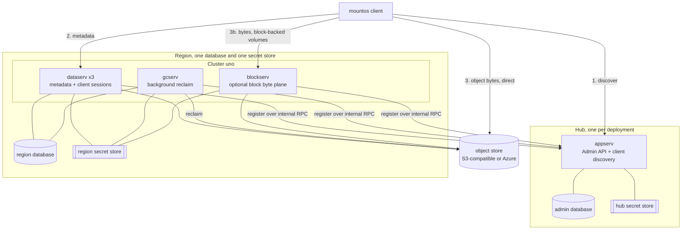
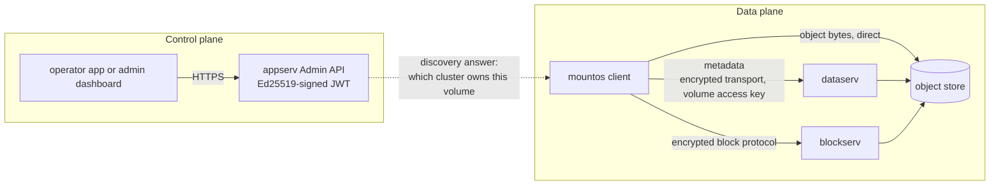
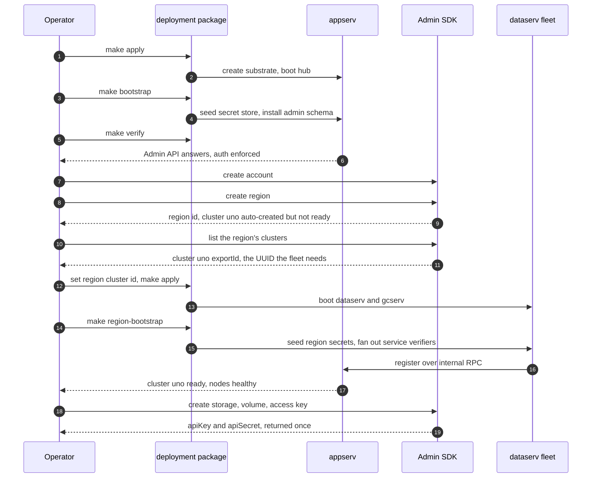
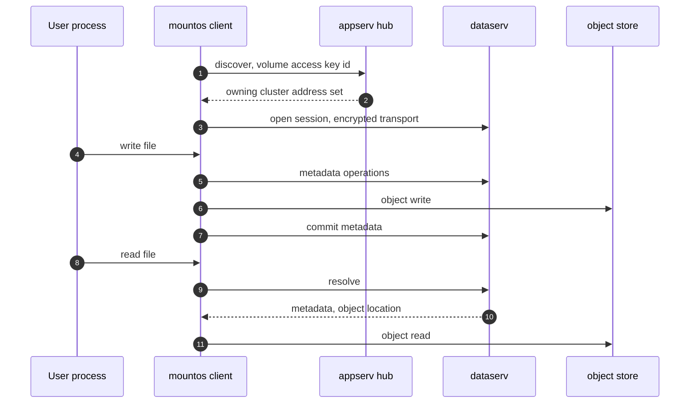
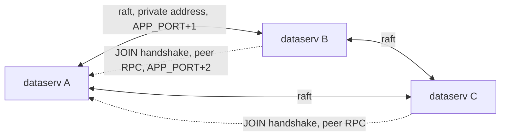
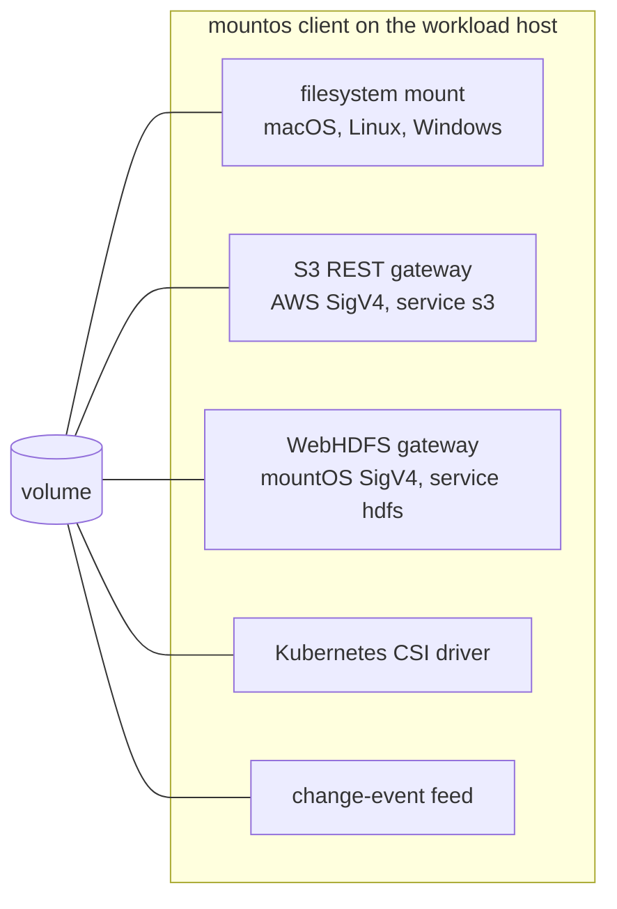

# Architecture and component interaction

Use this to explain the system, to size a deployment, and to decide where a new workload
attaches. The authoritative source is https://mountos.io/ai/topics/architecture.md and
https://mountos.io/ai/topics/components.md. Fetch those for the current detail. The
diagrams here are the shape you can draw for an operator without reading the full corpus.

Ports named below are the defaults. `APP_PORT` defaults to 6464, the raft port to
`APP_PORT+1`, and the peer RPC port to `APP_PORT+2`. `BLOCK_PORT` defaults to 9100 and peer
replication binds `BLOCK_PORT+1`. The hub's internal RPC port is set by the deployment
package. Confirm any port against https://mountos.io/skills/env.md before you put it in a
firewall rule.

## Topology

One hub serves the whole deployment. Regions sit under an account. Clusters partition load
inside a region.

Read the diagram this way:

- The client contacts the hub **once**, to discover. After that it talks to the owning
  cluster directly. The hub is not in the data path.
- The client reads and writes object bytes **itself**, straight to the backing store. Only
  metadata goes through dataserv. This drives firewall and sizing decisions: the object
  store must be reachable from every client host, not only from the fleet, and dataserv is
  not sized for user byte throughput. Block-backed volumes are the exception; their bytes go
  through blockserv.
- A region owns exactly one database and one secret store. A cluster owns neither. A
  cluster is a load partition, not a tenant boundary.
- A volume lives in one region on exactly one storage. Its data does not cross a region
  boundary while it is being served.

## Control plane and data plane

The two planes use different credentials and never share them:

- **Control plane.** The operator's Ed25519 admin private key signs a short-lived JWT for
  the Admin API. This key is the root credential for the deployment.
- **Data plane.** A per-volume access key pair, an id and a secret, authenticates the
  client. The same pair serves the filesystem mount, the S3 gateway, the WebHDFS gateway,
  the CSI driver, and the change-event feed.

A client never holds the admin key. An operator app never gives a browser the admin key.

## Bring-up sequence

The two `make apply` calls are not a mistake. The first brings up the hub. The region
cluster id does not exist until the hub is running and the region is created, so the region
fleet can only be configured after that.

## Mount and I/O path

Three properties that drive deployment decisions:

- Discovery returns the cluster's **client-facing** address. A client inside the same
  virtual network as the fleet usually cannot reach that address, because most clouds do
  not route an instance's public address back inside the network. Test from outside.
- The hub is out of the path after discovery, so hub sizing follows admin and discovery
  traffic, not user I/O.
- The object bytes never traverse dataserv. The client talks to the object store itself, so
  every client host needs reachability to that store, and dataserv is sized for metadata
  rate rather than throughput.

## Raft inside a cluster

dataserv nodes in one cluster form a raft quorum. This is where most first-deployment
failures live.

The join handshake uses the **peer RPC port**, not the raft port. Open both between region
services. With only the raft port open, the lowest-id node bootstraps alone and reports
healthy, and every other node loops on a join error. See [pitfalls.md](pitfalls.md).

## Access surfaces on one volume

Every surface below fronts the same bytes and the same metadata, and every one authenticates
with the same volume access key pair. All of them run from the `mountos` client binary.
There is no separate gateway service to deploy.

Pick a surface per workload:

| Workload | Surface |
| --- | --- |
| Anything that expects a POSIX filesystem | filesystem mount |
| Any S3 SDK or tool | S3 gateway. Minimum part size 8 MiB on every part except the last, listings capped at 1000 keys per page. Path-style addressing is the safe default |
| Stock Hadoop tooling, Spark, Hive, Trino, distcp, Flink | WebHDFS gateway, or the `hadoop-mountos` jar with the `mountos://` scheme |
| Pods that need a PersistentVolume | CSI driver `csi.mountos.io` |
| A service that must react to changes without walking the tree | change-event feed |

Details, flags, and SDK configuration are in https://mountos.io/skills/integrate.md and
https://mountos.io/skills/s3.md.
