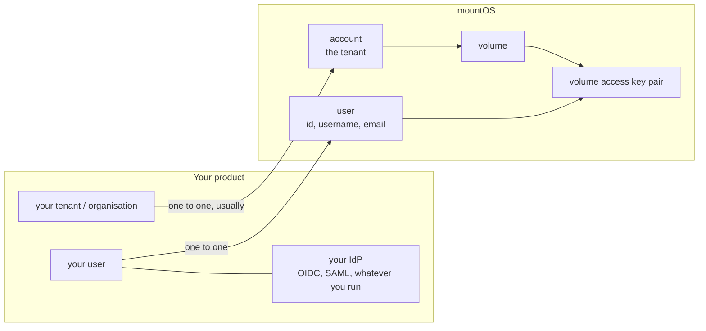
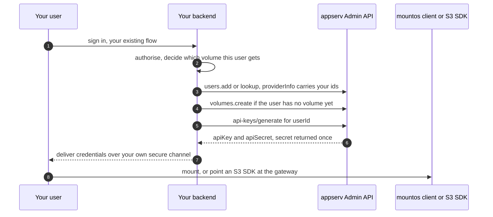
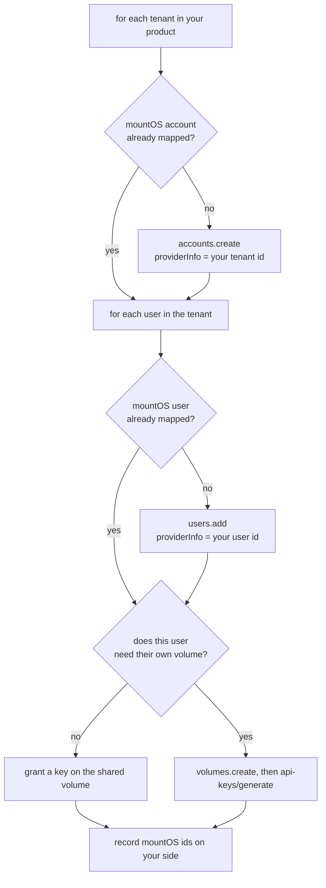

# Integrate an existing product and an existing user base

Use this when mountOS is being added under a product that already has customers, users, and
an identity provider. The goal is that your users keep their existing login and get storage,
without you rebuilding identity or handing anyone the operator root key.

Authoritative references: https://mountos.io/skills/integrate.md for the data-plane
surfaces, https://mountos.io/ai/topics/admin-sdk.md for the control plane, and the SDK
repository at https://github.com/mountos-io/mountos-admin-sdk, which ships a REST reference
(`api.md`) and an API spec (`api.yaml`) you can generate a client from in any language.

## mountOS is not your identity provider

Keep your identity provider. mountOS holds a thin record of each tenant and each user so it
can own quotas, keys, and audit, and you map your identifiers onto those records.

**Store the mountOS `id` on your own record. That mapping is the load-bearing one**, and it
is the only direction that works for users. Write it as soon as you create the record, so an
interrupted provisioning run is safe to retry.

`providerInfo` is a free-form JSON field on both the account and the user record, where you
put your own identifiers, for example your tenant id, your user id, and your plan tier. The
two records treat it differently, and the difference matters:

- On an **account**, `providerInfo` is written and read back. You can use it to answer "which
  of my tenants does this mountOS account belong to".
- On a **user**, `providerInfo` is accepted on create and update but is **not returned** by
  the user read or list endpoints, and user search matches only username and email. Do not
  design a reconciliation loop that expects to read it back from a user. Keep your own
  mountOS-id mapping instead, and treat user `providerInfo` as write-only annotation.

If you need the mountOS-user to your-user direction and cannot hold the mapping yourself,
encode your identifier in the `username` or `email` you create the user with, since those
are both returned and searchable.

## Two integration shapes

Pick one deliberately. They are not alternatives to each other; most products use both.

### Shape 1: backend-mediated, for machine access

Your backend holds the operator admin private key, authenticates your own user in your own
way, and then calls the Admin API on that user's behalf.

Rules for this shape:

- The admin private key stays on your server. It never reaches a browser, a mobile app, a
  CI log, or a client machine.
- The volume secret is returned once. Store it in your own secret store if your product
  needs to re-deliver it, or generate a fresh pair instead of trying to recover the old one.
- A volume holds a limited number of active key pairs per user, so generating a new pair
  can evict the oldest. The generate response reports which keys were evicted. Treat that
  as the signal to update or invalidate anything caching the old pair.
- To cut a user off from one volume, revoke by user. To offboard a user entirely,
  deactivate the user record as well.

### Shape 2: short-lived credentials, for end-user and agent access

When the credential goes anywhere less trusted than your backend, issue a time-limited key
instead of a long-lived pair. The Admin API can mint a short-term key for a volume, bound
optionally to a user, with an explicit expiry.

Use this for browser sessions, one-off jobs, mobile clients, agent tooling, and anything you
cannot revoke reliably. Short expiry is a better control than a revocation you have to
remember to run.

For a human who needs the admin dashboard, do not hand out the admin key at all. The
operator mints a very short-lived token and a login URL. That flow is described in the
Admin SDK topic.

## Onboarding an existing user base

Do this as a reconciliation loop, not a one-time script. Existing products keep creating and
deleting users while you migrate.

Practical points:

- **Decide the volume granularity first.** One volume per tenant with shared access is the
  common shape. One volume per user is cleaner for isolation and quotas but multiplies the
  object count and the administrative surface. Changing this later is a data migration, so
  decide before you onboard.
- **Bulk endpoints exist.** Read users in bulk by id rather than one call per user. Do not
  put a per-user API call inside a tight loop over a large customer base.
- **Make every step idempotent.** Look up by your own identifier before you create. A
  re-run of the loop after a failure must not create duplicates.
- **Deactivate rather than delete** when a user leaves, so audit history stays attributable.
- **Quotas are per volume.** If your product sells storage tiers, map the tier to the volume
  quota and update it when the plan changes.

## Choosing an SDK

| You are writing | Use |
| --- | --- |
| TypeScript or JavaScript on a server | `@mountos-io/admin-sdk`, server client with the private key |
| A browser or any client that must not hold the key | the SDK's request-based client, with your backend doing auth |
| Go | `github.com/mountos-io/mountos-admin-sdk/go` |
| Rust | the `mountos-admin-sdk` crate |
| Anything else | generate from `api.yaml`, or call the REST API directly using `api.md` |

All of them sign an Ed25519 JWT for the Admin API. The server clients sign locally and cache
the token for slightly under its lifetime, so token minting is not a per-request cost.

## Data-plane integration, briefly

Once a user holds a volume access key pair, the same pair works on every surface. Choose per
workload rather than standardising on one:

- A POSIX mount for anything that expects a filesystem.
- The S3 gateway for existing S3 SDK code. Path-style addressing is the safe default, keep multipart parts
  at 8 MiB or more except the last, and paginate listings at 1000 keys.
- The WebHDFS gateway, or the `hadoop-mountos` jar, for Spark, Hive, Trino, distcp, Flink.
- The CSI driver for Kubernetes PersistentVolumes.
- The change-event feed when a service must react to changes without walking the tree.

See [architecture.md](architecture.md) for how these relate, and
https://mountos.io/skills/integrate.md for the exact flags and configuration.

## What to check before you call the integration done

- A user of your product can sign in with your existing login and reach their data, with no
  mountOS-specific account creation step.
- Removing a user in your product removes their access in mountOS, verified by an actual
  denied request, not by the API call returning success.
- The admin private key does not appear in any client, any browser bundle, any log, or any
  repository.
- Re-running the reconciliation loop creates nothing new and changes nothing.
- A plan change in your product moves the corresponding quota.
