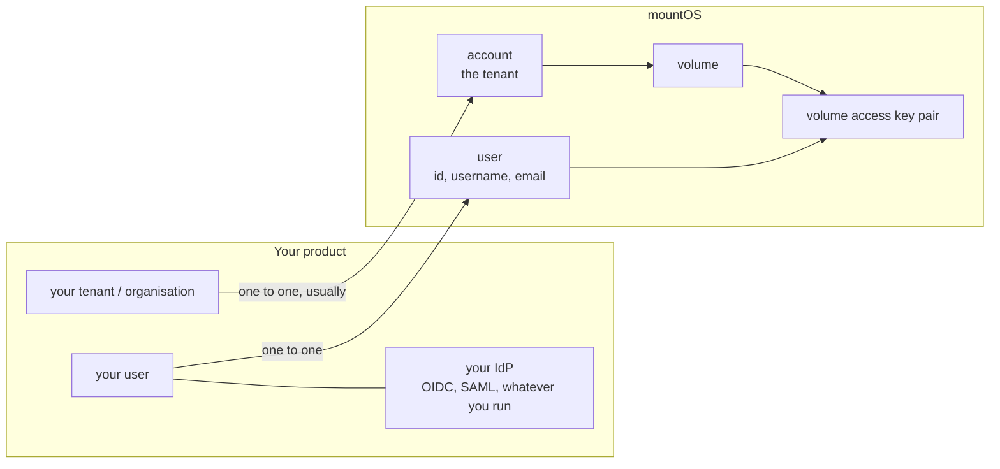
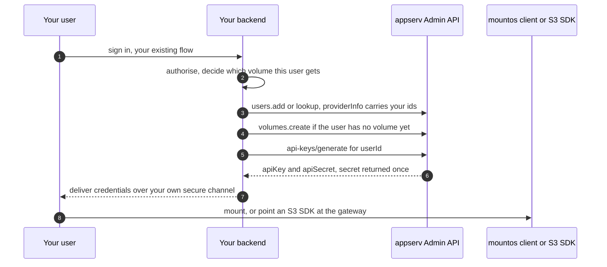
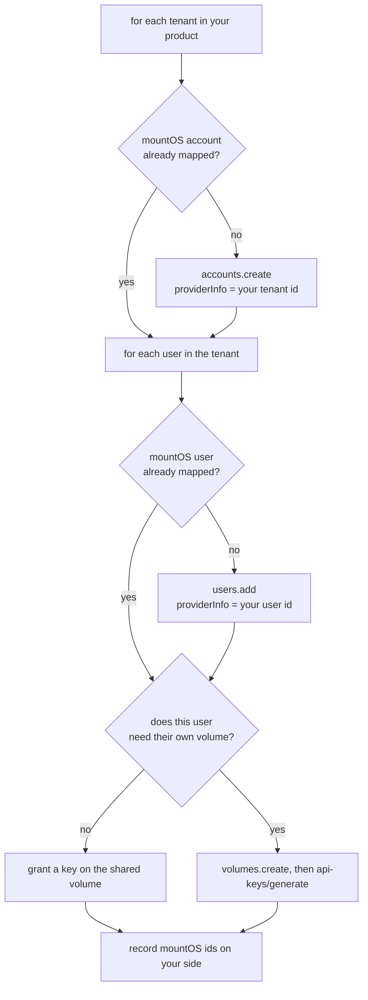

# mountOS integrate skill (single-file bundle, version 1.0.0)

This file is the entire skill in one document: the entry point followed by every
reference it links to. It exists for agents that cannot follow relative links or read
a directory. The links below point at sections in this same file.

Source and updates: https://github.com/mountos-io/skills

---

# mountOS integration

You are wiring [mountOS](https://mountos.io) under a product that already exists. Your users
already have logins. Your tenants already have identities. The goal is that they keep both
and gain storage, without you rebuilding identity and without anyone outside your backend
ever holding the operator root key.

This skill is for the application developer. If you still need to stand the deployment up,
that is a different job and a different skill: `deploy`, at
https://github.com/mountos-io/skills.

## Step 0: load the live context first

**Do this before you plan or write anything.** This repository is deliberately thin. The
authoritative documentation is generated from the current mountOS source, so it is correct
for the version the operator is actually running. Where this repository and the live
documentation disagree, the live documentation wins.

| Order | URL | What it gives you |
| --- | --- | --- |
| 1 | https://mountos.io/skill.md | Entry point: the mental model and the task routing |
| 2 | https://mountos.io/skills/integrate.md | The data-plane surfaces, with exact flags |
| 3 | https://mountos.io/ai/topics/admin-sdk.md | The control plane, auth, pagination, errors |
| 4 | https://github.com/mountos-io/mountos-admin-sdk | `api.md` REST reference, `api.yaml` spec for codegen |

Fetch https://mountos.io/skills/s3.md when the workload is S3, and
https://mountos.io/skills/volumes.md when you need volume, fork, or key semantics.

If you have no network access, say so before you continue. You can work from the reference
here, but tell the developer that version-specific details are unverified.

## The one thing to get right first

mountOS is **not** your identity provider and does not want to be. It holds a thin record of
each tenant and each user so it can own quotas, keys, and audit. You map your identifiers
onto those records and keep your own.

**Store the mountOS id on your own record.** That mapping is load-bearing, and for users it
is the only direction that works. There is a `providerInfo` field for your own identifiers,
but it behaves differently on accounts and users in a way that will silently break a
reconciliation loop built on the wrong assumption. The details, and the workaround when you
cannot hold the mapping yourself, are in
[references/user-mapping.md](#reference-user-mapping).

## Decide these before you write code

Each of these is expensive to change later. Two of them are data migrations.

1. **Volume granularity.** One volume per tenant with shared access is the common shape. One
   volume per user isolates cleanly and makes quotas simple, but multiplies object count and
   administrative surface. Changing this after onboarding is a data migration.
2. **Credential lifetime.** A long-lived key pair for machine access from your backend, or a
   short-lived key for anything less trusted. Most products need both. Getting this wrong
   means either a credential you cannot revoke or a re-issue path you did not build.
3. **Who holds the admin key.** It is the root credential for the whole deployment. It stays
   on your server. If any design puts it in a browser, a mobile app, a CI log, or a client
   machine, that design is wrong and needs replacing rather than guarding.
4. **What happens when a plan changes.** Quotas are per volume. If you sell storage tiers,
   decide now how a tier change moves the quota.

## Route the task

| You are doing | Read |
| --- | --- |
| Mapping your tenants and users onto mountOS records | [references/user-mapping.md](#reference-user-mapping) |
| Issuing credentials to a backend, a browser, or an agent | [references/user-mapping.md](#reference-user-mapping), the two shapes |
| Onboarding an existing customer base | [references/user-mapping.md](#reference-user-mapping), the reconciliation loop |
| Picking a data surface for a workload | The table below, then https://mountos.io/skills/integrate.md |
| Tuning an S3 client | https://mountos.io/skills/s3.md |
| Standing up the deployment itself | The `deploy` skill, https://github.com/mountos-io/skills |

## Pick a surface per workload

Every surface below fronts the same bytes and the same metadata, and every one authenticates
with the same per-volume access key pair. All of them run from the `mountos` client binary
on the host that needs them. There is no separate gateway service to deploy.

| Workload | Surface | The constraint that bites |
| --- | --- | --- |
| Anything expecting a POSIX filesystem | Filesystem mount | Mount point is positional; the secret flag is a switch reading from prompt or stdin, never a flag value |
| Existing S3 SDK code | S3 gateway | Multipart parts at 8 MiB or more except the last; listings cap at 1000 keys per page |
| Spark, Hive, Trino, distcp, Flink | WebHDFS gateway, or the `hadoop-mountos` jar | Its SigV4 service name differs from S3's; do not point an S3 signer at it |
| Kubernetes PersistentVolumes | CSI driver `csi.mountos.io` | Key pair arrives through a node-stage secret |
| Reacting to change without walking the tree | Change-event feed | Per volume, and needs retention enabled on that volume |

Choose per workload rather than standardising on one. They are not tiers; they are different
shapes for different consumers of the same data.

## Hard rules

- **The admin private key never leaves your backend.** Not to a browser, not to a mobile
  app, not into a CI log, not into a repository. It is the root credential for the entire
  deployment, not a per-tenant secret.
- **A volume secret is returned once.** Store it in your own secret store if you must
  re-deliver it, or generate a fresh pair. Do not build a flow that assumes you can read it
  back.
- **Generating a new key pair can evict an older one.** The response tells you which. Treat
  that as the signal to invalidate anything caching the old pair.
- **Deactivate rather than delete** when a user leaves, so audit history stays attributable.
- **Never put credentials in a URL or a query string**, on any surface.
- **Prefer a short expiry to a revocation you have to remember to run.**

## Verify, do not assume

An integration that returns HTTP 200 everywhere can still be wrong in ways that only show up
as a support ticket. Before you call it done:

- A user of your product signs in with your existing login and reaches their data, with no
  mountOS-specific account-creation step in their way.
- Removing a user in your product removes their access, proven by an **actually denied
  request**, not by the revoke call returning success.
- Re-running the reconciliation loop creates nothing and changes nothing.
- A plan change moves the corresponding quota.
- The admin key appears in no client bundle, no log, and no repository. Grep for it.

## What is in this repository

- [references/user-mapping.md](#reference-user-mapping): the mapping model with diagrams,
  the two credential-issuing shapes, the reconciliation loop for an existing user base, SDK
  selection, and the completion checklist.

---

## Mapping an existing user base

The detail behind the `integrate` skill: how your tenants and users map onto mountOS
records, how credentials are issued, and how to onboard a customer base that already
exists.

Authoritative references: https://mountos.io/skills/integrate.md for the data-plane
surfaces, https://mountos.io/ai/topics/admin-sdk.md for the control plane, and the SDK
repository at https://github.com/mountos-io/mountos-admin-sdk, which ships a REST reference
(`api.md`) and an API spec (`api.yaml`) you can generate a client from in any language.

### mountOS is not your identity provider

Keep your identity provider. mountOS holds a thin record of each tenant and each user so it
can own quotas, keys, and audit, and you map your identifiers onto those records.

**Store the mountOS `id` on your own record. That mapping is the load-bearing one**, and it
is the only direction that works for users. Write it as soon as you create the record, so an
interrupted provisioning run is safe to retry.

`providerInfo` is a free-form JSON field on both the account and the user record, where you
put your own identifiers, for example your tenant id, your user id, and your plan tier. The
two records treat it differently, and the difference matters:

- On an **account**, `providerInfo` is written and read back. You can use it to answer "which
  of my tenants does this mountOS account belong to".
- On a **user**, `providerInfo` is accepted on create and update but is **not returned** by
  the user read or list endpoints, and user search matches only username and email. Do not
  design a reconciliation loop that expects to read it back from a user. Keep your own
  mountOS-id mapping instead, and treat user `providerInfo` as write-only annotation.

If you need the mountOS-user to your-user direction and cannot hold the mapping yourself,
encode your identifier in the `username` or `email` you create the user with, since those
are both returned and searchable.

### Two integration shapes

Pick one deliberately. They are not alternatives to each other; most products use both.

#### Shape 1: backend-mediated, for machine access

Your backend holds the operator admin private key, authenticates your own user in your own
way, and then calls the Admin API on that user's behalf.

Rules for this shape:

- The admin private key stays on your server. It never reaches a browser, a mobile app, a
  CI log, or a client machine.
- The volume secret is returned once. Store it in your own secret store if your product
  needs to re-deliver it, or generate a fresh pair instead of trying to recover the old one.
- A volume holds a limited number of active key pairs per user, so generating a new pair
  can evict the oldest. The generate response reports which keys were evicted. Treat that
  as the signal to update or invalidate anything caching the old pair.
- To cut a user off from one volume, revoke by user. To offboard a user entirely,
  deactivate the user record as well.

#### Shape 2: short-lived credentials, for end-user and agent access

When the credential goes anywhere less trusted than your backend, issue a time-limited key
instead of a long-lived pair. The Admin API can mint a short-term key for a volume, bound
optionally to a user, with an explicit expiry.

Use this for browser sessions, one-off jobs, mobile clients, agent tooling, and anything you
cannot revoke reliably. Short expiry is a better control than a revocation you have to
remember to run.

For a human who needs the admin dashboard, do not hand out the admin key at all. The
operator mints a very short-lived token and a login URL. That flow is described in the
Admin SDK topic.

### Onboarding an existing user base

Do this as a reconciliation loop, not a one-time script. Existing products keep creating and
deleting users while you migrate.

Practical points:

- **Decide the volume granularity first.** One volume per tenant with shared access is the
  common shape. One volume per user is cleaner for isolation and quotas but multiplies the
  object count and the administrative surface. Changing this later is a data migration, so
  decide before you onboard.
- **Bulk endpoints exist.** Read users in bulk by id rather than one call per user. Do not
  put a per-user API call inside a tight loop over a large customer base.
- **Make every step idempotent.** Look up by your own identifier before you create. A
  re-run of the loop after a failure must not create duplicates.
- **Deactivate rather than delete** when a user leaves, so audit history stays attributable.
- **Quotas are per volume.** If your product sells storage tiers, map the tier to the volume
  quota and update it when the plan changes.

### Choosing an SDK

| You are writing | Use |
| --- | --- |
| TypeScript or JavaScript on a server | `@mountos-io/admin-sdk`, server client with the private key |
| A browser or any client that must not hold the key | the SDK's request-based client, with your backend doing auth |
| Go | `github.com/mountos-io/mountos-admin-sdk/go` |
| Rust | the `mountos-admin-sdk` crate |
| Anything else | generate from `api.yaml`, or call the REST API directly using `api.md` |

All of them sign an Ed25519 JWT for the Admin API. The server clients sign locally and cache
the token for slightly under its lifetime, so token minting is not a per-request cost.

### Data-plane integration, briefly

Once a user holds a volume access key pair, the same pair works on every surface. Choose per
workload rather than standardising on one:

- A POSIX mount for anything that expects a filesystem.
- The S3 gateway for existing S3 SDK code. Path-style addressing is the safe default, keep multipart parts
  at 8 MiB or more except the last, and paginate listings at 1000 keys.
- The WebHDFS gateway, or the `hadoop-mountos` jar, for Spark, Hive, Trino, distcp, Flink.
- The CSI driver for Kubernetes PersistentVolumes.
- The change-event feed when a service must react to changes without walking the tree.

See https://mountos.io/skills/integrate.md for the exact flags and configuration, and the
`deploy` skill's architecture reference (https://github.com/mountos-io/skills) for how the
surfaces relate to the rest of the system.

### What to check before you call the integration done

- A user of your product can sign in with your existing login and reach their data, with no
  mountOS-specific account creation step.
- Removing a user in your product removes their access in mountOS, verified by an actual
  denied request, not by the API call returning success.
- The admin private key does not appear in any client, any browser bundle, any log, or any
  repository.
- Re-running the reconciliation loop creates nothing new and changes nothing.
- A plan change in your product moves the corresponding quota.
